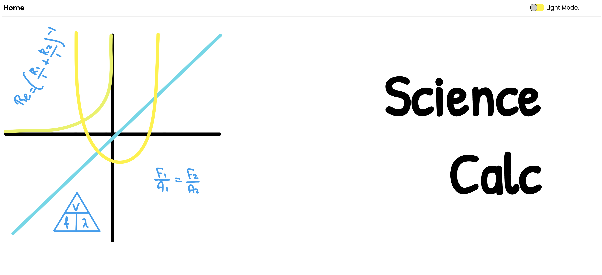
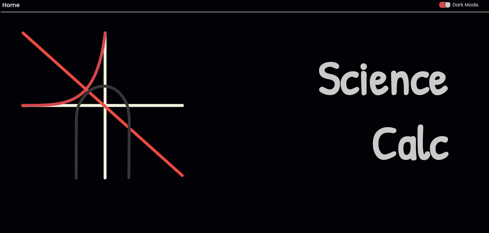
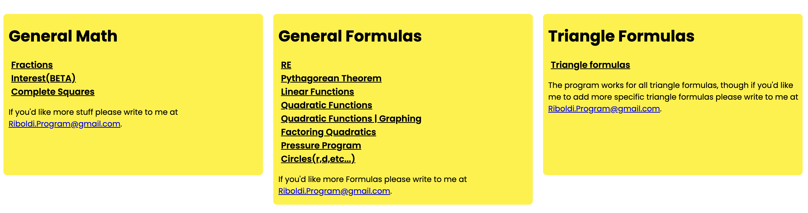
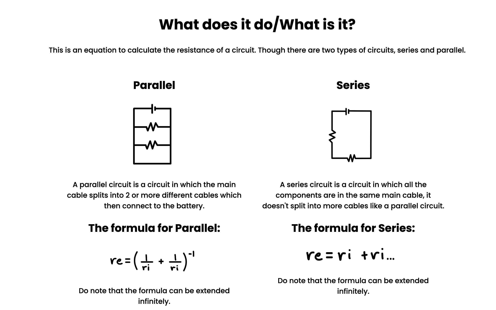
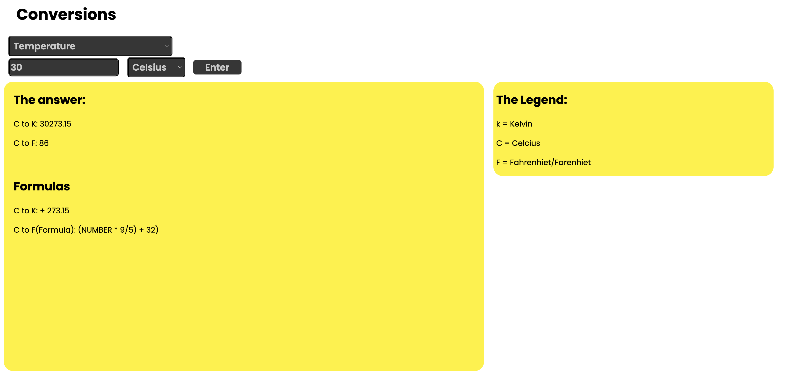
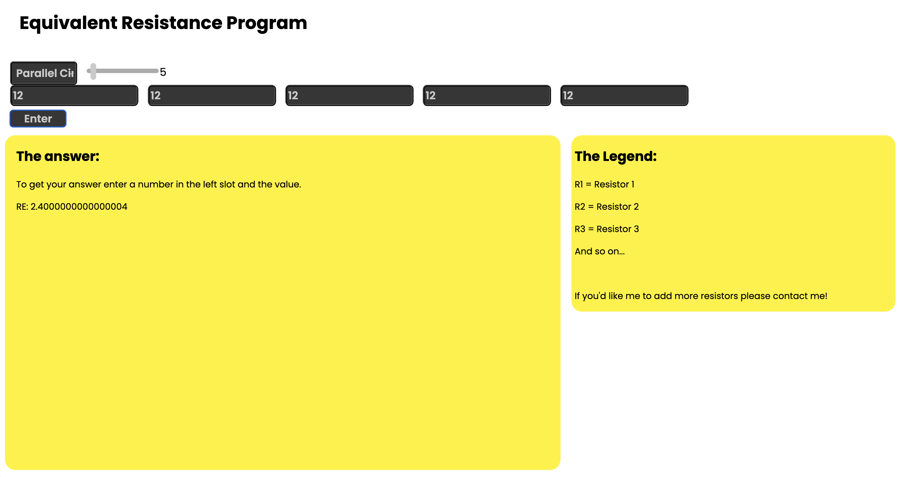

# Science Calc

An educational web application developed to help high school students solve common mathematics, physics, and chemistry calculations.

Science Calc was my first web development project and served as an opportunity to learn front-end development while building a tool with practical value for students.

Although the website is no longer online, this repository preserves the source code as part of my development portfolio.

---

## Features

- Formula calculators
- Physics calculations
- Chemistry calculations
- Mathematics utilities
- Formula explanations
- Responsive user interface

---

## Purpose

The goal of this project was to make frequently used scientific formulas easier to access and understand by combining simple calculators with brief explanations of the underlying concepts.

Rather than simply displaying equations, the application was designed to help students understand when and how each formula should be used.

---

## Technologies Used

### Languages

- HTML
- CSS
- JavaScript

### Tools

- Visual Studio Code
- Git
- GitHub

---

## Screenshots

Home page but in dark mode

All the different formulas 

Explanation example

Conversions Page (like from C° to F°)

Resistor ohm calculation

---

## What I Learned

This project introduced me to many of the concepts that became the foundation of my later software projects, including:

- HTML structure
- CSS styling
- Responsive web design
- JavaScript programming
- DOM manipulation
- Form validation
- User interface design
- Project organization

---

## Project Status

This project is no longer actively maintained.

It remains available as part of my portfolio to document my progression as a developer and to demonstrate one of my earliest complete web applications.

---

## Future Improvements

If the project were to be continued, potential improvements would include:

- Modern UI redesign
- Improved mobile experience
- Additional scientific calculators
- Graphing capabilities
- Unit conversion tools
- Backend integration
- Progressive Web App (PWA) support

---

## License

This project is licensed under the MIT License.
